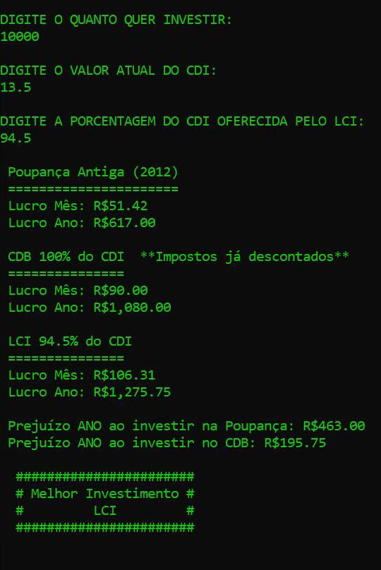

# Rendimento

Programa criado com .net e c#. Este avalia o melhor investimento entre poupança antiga (2012), CDB e LCI.
O usuário coloca o valor que quer investir, a taxa de CDI atual e a porcentagem oferecida do CDI ao investir no LCI. O programa retornará o lucro mês/ano para cada investimento e determinará qual o mais lucrativo.
.exe incluído para teste.
_____

Software created using .net and c#. It evaluates the best investment between old savings account (2012), CDB and LCI. 
The user enters an amount they want to invest, the current CDI rate and the offered percentage of the CDI when investing in LCI. The program will return the month/year profit for each investment and determine which investment is the most profitable. 
.exe included for testing.

